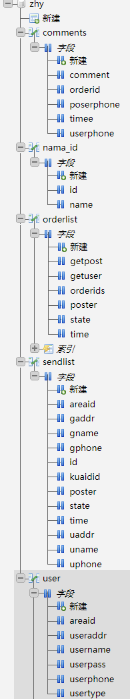
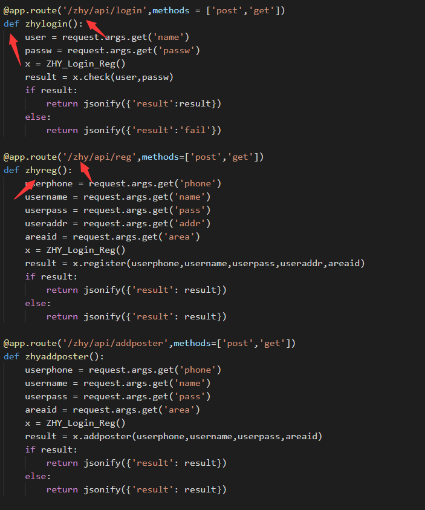

# 数据库
## comments 评论表  
- orderid    快递订单编号  
- userphone  用户手机号  
- poserphone 快递员手机号 
- comment    评论正文  
- timee      评论时间  
## nama_id 小区编号对应表  
- id 小区编号  
- name 小区名称  
## orderlist 派往小区外订单列表  
- orderids 订单编号  
- getuser  普通用户(小区住户) 手机号 
- poster   快递员手机号  
- state    订单状态(0未完成,1已完成)  
- getpost  发or收  
- time     订单创建时间  
## sendlist 发到快递公司订单列表  
- id       订单编号  
- uname    发送者(x小区住户)
- uphone   发送者手机号  
- areaid   小区编号  
- uaddr    发送者(小区用户)门牌号  (areaid)-(门牌号)  
- gname    接收人姓名  
- gphone   接收人手机号  
- gaddr    接收人地址  
- time     订单创建时间  
- statu    订单状态  
- poster   快递员手机号  
- kuaidid  快递公司提供的快递单号  
## user 用户表  
- userphone 用户手机号  
- username  用户姓名  
- userpass  用户登录密码  
- usertype  用户类型(0小区系统管理员,1小区住户普通用户,2小区快递员)  
- useraddr  用户地址  
- areaid    小区编号

  
***
# 接口设计 (run.py中所有/zhy开头的）  

   

1. /zhy/api/login  登录接口  
2. /zhy/api/reg    注册  
3. /zhy/api/addposter  添加快递员(小区管理者)  
4. /zhy/api/changepass 更换密码  
5. /zhy/api/orders  获取去小区内快递  
6. /zhy/api/poster_send  快递员添加自己需要派送到住户的快递  
7. /zhy/api/user_send  用户添加自己发送的快递  
8. /zhy/api/user_out  获取用户发送到小区外快递  
